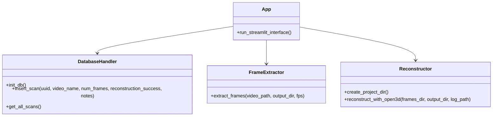

# PlantSketch

PlantSketch is a tool for creating 3D point cloud models of plants and gardens from video footage or images. The application provides an easy-to-use interface for processing visual data and generating 3D visualizations that can be used for garden planning, plant analysis, and documentation.

## Features

- **Dual Input Methods**: Process either video footage or multiple image files
- **Frame Extraction**: Automatically extract frames from videos at adjustable FPS
- **3D Reconstruction**: Generate point clouds using Open3D technology
- **Project Management**: Track scan history with unique IDs for each project
- **User-Friendly Interface**: Simple Streamlit web interface for easy operation

## Requirements

- Python 3.8 or higher
- OpenCV for image and video processing
- Open3D for 3D reconstruction
- Streamlit for the web interface

## Installation

1. Clone the repository:
   ```
   git clone https://github.com/zbuhrer/plantsketch.git
   cd plantsketch
   ```

2. Create a virtual environment and activate it:
   ```
   python -m venv gardenvenv
   source gardenvenv/bin/activate  # On Windows: gardenvenv\Scripts\activate
   ```

3. Install dependencies:
   ```
   pip install -r requirements.txt
   ```

## Usage

1. Start the application:
   ```
   streamlit run app.py
   ```

2. Using the web interface:
   - Choose between video or image input
   - For video: Upload a video file and adjust the FPS slider
   - For images: Upload multiple image files (minimum 5 recommended)
   - Click "Start Scan" to begin processing
   - View the processing log and results

3. Review scan history at the bottom of the page

## System Architecture


