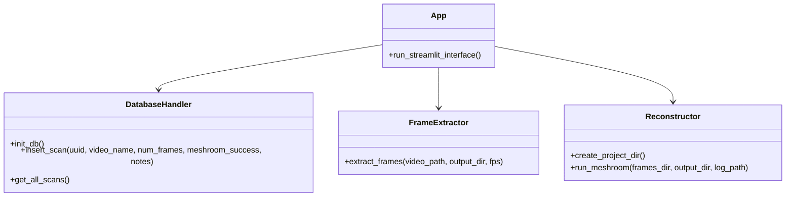

# PlantSketch

PlantSketch is a tool for creating 3D models of gardens and plants from video footage. The application extracts frames from videos, processes them through Meshroom (a photogrammetry software), and generates 3D point clouds and models for visualization and analysis.

## Requirements

- Python 3.8 or higher
- Meshroom (for 3D reconstruction)

## Installation

1. Clone the repository:
   ```
   git clone https://github.com/zbuhrer/plantsketch.git
   cd plantsketch
   ```

2. Create a virtual environment and activate it:
   ```
   python -m gardenvenv venv
   source gardenvenv/bin/activate
   ```

3. Install dependencies:
   ```
   pip install -r requirements.txt
   ```

4. Install Meshroom following the instructions at [https://alicevision.org/#meshroom](https://alicevision.org/#meshroom)
   - Make sure the `meshroom_batch` command is available in your PATH

## Usage

1. Start the application:
   ```
   streamlit run app.py
   ```

2. In your web browser:
   - Upload a video file of your garden or plants
   - Adjust the FPS slider to control how many frames are extracted
   - Click "Start Scan" to begin processing
   - The application will extract frames, run Meshroom, and store the results

3. View scan history at the bottom of the page

## System Architecture


